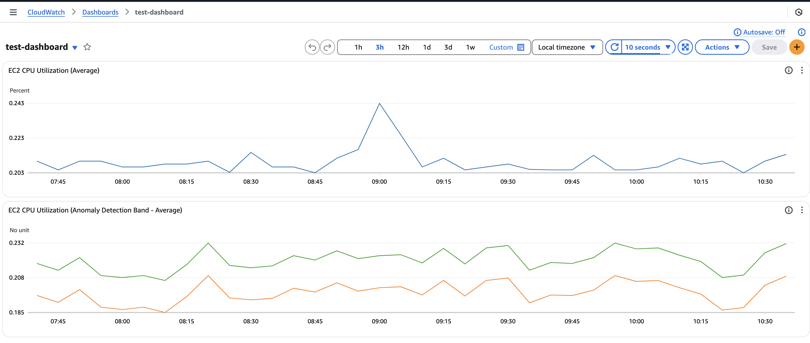

# terraform-provider-aws-cloudwatch-dashboard

A Terraform provider that enables structural definition of AWS CloudWatch Dashboards using HCL (HashiCorp Configuration Language). This provider internally constructs CloudWatch Dashboard JSON by composing multiple data sources.

## Installation

To install this provider, copy and paste this code into your Terraform configuration. Then, run `terraform init`.

```hcl
terraform {
  required_providers {
    cwdashboard = {
      source  = "yamoyamoto/aws-cloudwatch-dashboard"
      version = "~> 0.1"
    }
  }
}
```

## Example Usage

Here is an example of how to use this provider to create a CloudWatch dashboard:

```hcl
# define a metric
data "cwdashboard_metric" "this" {
  metric_name = "CPUUtilization"
  namespace   = "AWS/EC2"
  dimensions_map = {
    InstanceId = "i-0123456789abcdef0"
  }
  statistic = "Average"
}

# define an metric expression from some metrics
data "cwdashboard_metric_expression" "this" {
  expression = "ANOMALY_DETECTION_BAND(m1, 2)"
  label      = "Anomaly Detection Band"
  using_metrics = {
    m1 = data.cwdashboard_metric.this.json
  }
}

# define a Graph Widget with some metrics
data "cwdashboard_graph_widget" "this" {
  width  = 24
  height = 6

  title = "EC2 CPU Utilization (Anomaly Detection Band)"

  left = [
    data.cwdashboard_metric_expression.this.json,
  ]
}

# define a Dashboard with some widgets
data "cwdashboard" "this" {
  start           = "-PT7D"
  period_override = "auto"
  widgets = [
    data.cwdashboard_graph_widget.this.json,
  ]
}

# to create dashboard, use AWS Terraform Provider with the dashboard JSON
resource "aws_cloudwatch_dashboard" "this" {
  dashboard_name = "test-dashboard"
  dashboard_body = data.cwdashboard.this.json
}
```

The created dashboard will look like this:



## Documentation

For detailed information about available data sources and configurations, please refer to the [documentation](https://registry.terraform.io/providers/yamoyamoto/cwdashboard/latest/docs/data-sources/cwdashboard).

## Contributing

We welcome contributions! If you would like to contribute, please follow these guidelines:

1. Fork the repository
2. Create a new branch (`git checkout -b feature-branch`)
3. Make your changes
4. Commit your changes (`git commit -am 'Add new feature'`)
5. Push to the branch (`git push origin feature-branch`)
6. Create a new Pull Request

Please ensure that your code follows the project's coding standards and includes appropriate tests.
